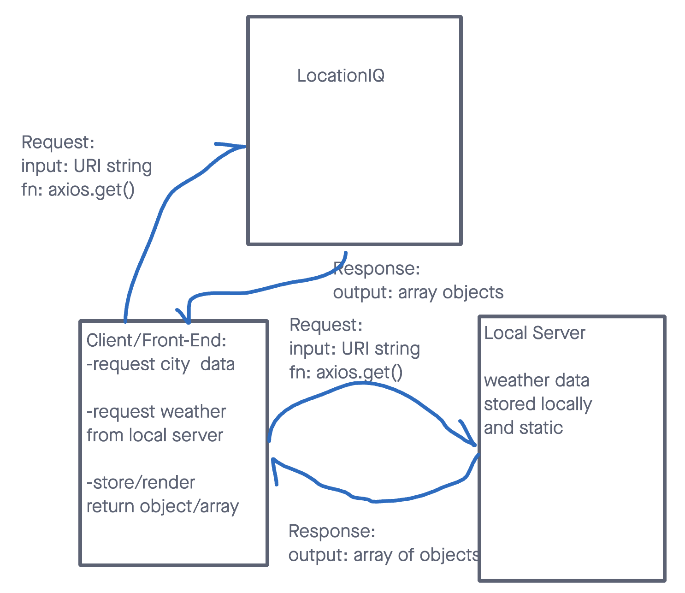

# City Explorer

**Author**: Jacob Bassett
**Version**: 1.0.0 

## Overview

This will be the back-end server for the City-Explorer website made by Jacob Bassett for his Code Fellows 301 class.

## Getting Started

<!-- What are the steps that a user must take in order to build this app on their own machine and get it running? -->

## Architecture

 * This wireframe is a plan how the REST requests will work between our server and frontend app.
 * Made with Jelani.

## Change Log

<!-- Use this area to document the iterative changes made to your application as each feature is successfully implemented. Use time stamps. Here's an example:

01-01-2001 4:59pm - Application now has a fully-functional express server, with a GET route for the location resource. -->
Pending

## Credit and Collaborations

[Jelani Rhinehart](https://github.com/Jchips)
 * Made the wireframe with me for Lab07

## Development Estimates

Name of feature: Set Up Server Repository
Estimate of time needed to complete: 03:00
Start time: 02:00
Finish time: 07:00
Actual time needed to complete: 05:00

Name of feature: Accept Get Request and Return Formated Response
Estimate of time needed to complete: 01:00
Start time: 07:00
Finish time: 09:00
Actual time needed to complete: 02:00

Name of feature: Display Error
Estimate of time needed to complete: 01:00
Start time: 09:00
Finish time: 10:00
Actual time needed to complete: 01:00

