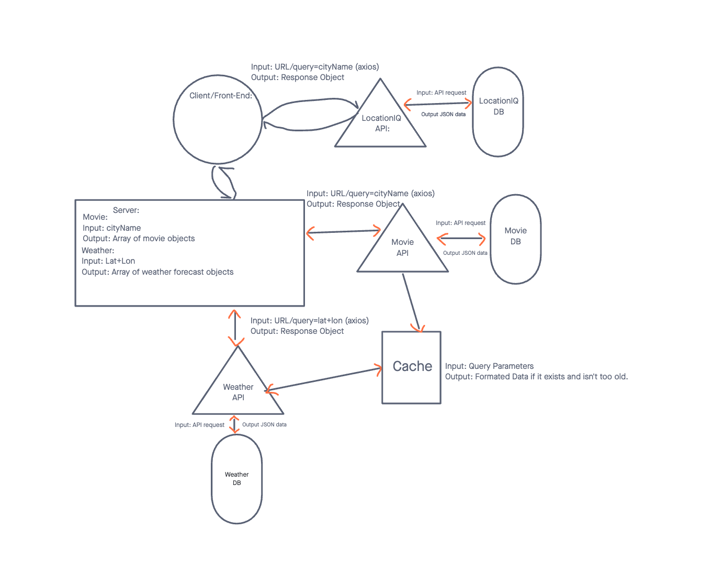

# City Explorer

**Author**: Jacob Bassett
**Version**: 1.0.0 

## Overview

This will be the back-end server for the City-Explorer website made by Jacob Bassett for his Code Fellows 301 class.

## Architecture

 * This wireframe is a plan how the REST requests will work between our server and frontend app.
 * Made with Jelani.

 * This is a full wireframe of how our app should work. The latest update being with the cacheing of data.
 * Made with Zeegii

## Credit and Collaborations

[Jelani Rhinehart](https://github.com/Jchips)
 * Made the wireframe with me for Lab07

[Zeegii Ulziibaatar](https://github.com/ZG79)
* Made the wireframe with me for Lab10

## Development Estimates

Name of feature: Set Up Server Repository
Estimate of time needed to complete: 03:00
Start time: 02:00
Finish time: 07:00
Actual time needed to complete: 05:00

Name of feature: Accept Get Request and Return Formated Response
Estimate of time needed to complete: 01:00
Start time: 07:00
Finish time: 09:00
Actual time needed to complete: 02:00

Name of feature: Display Error
Estimate of time needed to complete: 01:00
Start time: 09:00
Finish time: 10:00
Actual time needed to complete: 01:00

